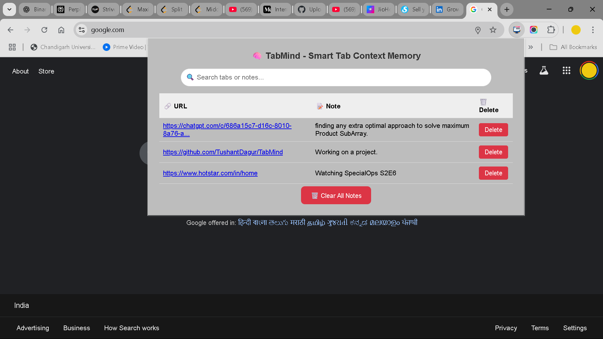
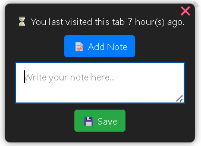

# 🧠 TabMind – Smart Tab Context Memory

TabMind helps you stay focused and organized by remembering **why** you opened a tab in the first place.  
It displays a reminder when you revisit a stale tab and lets you save short notes for context.

> 🔒 No cloud storage. Everything is stored locally in your browser.

---

## ✨ Features

- ⏳ Shows a popup if you revisit a stale tab after a while.
- 📝 Add short notes to remember the purpose of a tab.
- 💾 Notes saved per-tab and persist across browser sessions.
- 🔍 Built-in search to filter notes.
- 🗑 Delete individual notes or clear all at once.
- 📋 Popup interface to view, manage, and delete notes easily.

---

## 📸 Screenshots




---

## 🛠 How to Install Manually

> Chrome Web Store isn't required. You can install manually in less than a minute.

1. **Download the extension files**  
   → [Download ZIP]
   Or clone it:
   ```bash
   git clone https://github.com/TushantDagur/tabmind.git
   ```
2. **Go to Chrome** and open `chrome://extensions`
3. **Enable Developer Mode** (top-right toggle)
4. Click **Load Unpacked**
5. Select the folder where you saved or unzipped the extension
6. Done ✅

---

## 🔍 How It Works

- The extension tracks the time you last visited a tab.
- If you return to a tab after X minutes, a popup appears with:
  - Time since last visit
  - Option to save a note
- Notes can be viewed in the extension's popup.

---

## 📁 Folder Structure

```
tabmind/
│
├── manifest.json
├── background.js
├── content.js
├── popup.html
├── popup.js
├── styles.css
├── icons/
│   └── main.png
├── screenshots/
│   └── popup.png
│   └── stale_reminder.png
└── README.md
```

---

## 📢 Known Limitations

- Notes are stored using `chrome.storage.local`, so they won't sync across devices.
- Does not support tab groups (yet).
- Not available on Chrome Web Store (avoids $5 developer fee intentionally).

---

## 🧑‍💻 Author

**Tushant Dagur**  
🔗 [LinkedIn](https://www.linkedin.com/in/tushant-dagur-915bb11bb)  
💻 MCA Student | Builder of useful things

---

## 📬 Feedback / Suggestions

Open an issue or contact me on LinkedIn. I’d love to hear your feedback and ideas!

---
